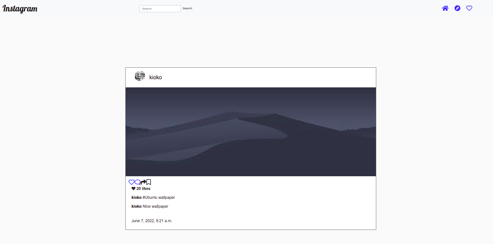

##Instagram

## AUTHOR
Brenda Nthenya

## DESCRIPTION
This is a Django web application replica website for popular photo app instagram. It requires users to sign in to the application. A user can follow other users and see their pictures on my timeline and also like a picture or leave a comment. 

## SETUP 
To access this project on your local files, you can clone it using these steps:
1. Open your Terminal.
2. Use this command to clone `$ git clone https://github.com/brenda-nthenya/insta-clone.git`
3. This will clone the repository into your local folder.

## BDD 
1. Provides comments forms.
    | input    |     output  | 
      | :--        | :---        |
    | comments typed in the form input   | new comments addded to the image |

2. Povides forms to post photos.
    | input    |     output  | 
      | :--        | :---        |
    | account action option/form displayed   | form page displayed/new post added | 

3. Provides search form.
    | input    |     output  | 
      | :--        | :---        |
    | search term entered in the search field  | number of matched user result displayed in the page | 
           
4. Show photo details .
    | input    |     output  | 
      | :--        | :---        |
    | image clicked | a new page loaded with image details | 

## DEPENDENCIES
1. Django-bootstrap
2. Pillow
3. Psycopg2
4. Django_registration
5. Python decouple
6. Python virtual
7. Whitenoise
8. Gunicorn

## TECHNOLOGIES USED
1. Python3 
2. Html
3. Css

## LIVE
View [LIVE](https://instaglam-clone.herokuapp.com/)

## LICENSE
MIT License

Copyright (c) 2022 brenda-nthenya

Permission is hereby granted, free of charge, to any person obtaining a copy
of this software and associated documentation files (the "Software"), to deal
in the Software without restriction, including without limitation the rights
to use, copy, modify, merge, publish, distribute, sublicense, and/or sell
copies of the Software, and to permit persons to whom the Software is
furnished to do so, subject to the following conditions:

The above copyright notice and this permission notice shall be included in all
copies or substantial portions of the Software.

THE SOFTWARE IS PROVIDED "AS IS", WITHOUT WARRANTY OF ANY KIND, EXPRESS OR
IMPLIED, INCLUDING BUT NOT LIMITED TO THE WARRANTIES OF MERCHANTABILITY,
FITNESS FOR A PARTICULAR PURPOSE AND NONINFRINGEMENT. IN NO EVENT SHALL THE
AUTHORS OR COPYRIGHT HOLDERS BE LIABLE FOR ANY CLAIM, DAMAGES OR OTHER
LIABILITY, WHETHER IN AN ACTION OF CONTRACT, TORT OR OTHERWISE, ARISING FROM,
OUT OF OR IN CONNECTION WITH THE SOFTWARE OR THE USE OR OTHER DEALINGS IN THE
SOFTWARE.